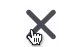

# Hamburger Icon

Demo



# How to use

Create these component in the project.

```txt
- Hamburger.js
- hamburger.module.scss
```

Call where you need it,

Say, we need in **Header Component**

```js
import { useState } from 'react'
import Hamburger from './Hamburger'

... // Other imports

export default function Header() {

      const [hamburger, setHamburger] = useState(false)

      ... // Other states

      return(
          <>
                ... // Other Components or something else

                // We need hamburger down here
                  <Hamburger hamburger={hamburger} setHamburger={setHamburger} />

                 ... // Other Components or something else

          </>

      )
}
```
